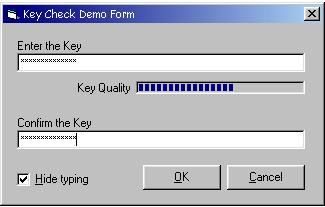



## \[ Key or Password Quality Check \]

### Description

How secure is the password I use? Is my key easy to crack? This function checks the quality from your password or key and returns a rating value between 0 and 100. The returnvalue could be used to fill a progressbar to visualize the password quality, to require a minimum rating for validation, or lots of other stuff. The Zip contains the module, a ready to use demo form, and all the comment you need to get started. All Comments or suggestions are most welcom:-) ...
 
### More Info
 

             |
---                |---
**Submitted On**   |2005-03-26 07:51:04
**By**             |[D\. Rijmenants](https://github.com/Planet-Source-Code/PSCIndex/blob/master/ByAuthor/d-rijmenants.md)
**Level**          |Beginner
**User Rating**    |4.3 (26 globes from 6 users)
**Compatibility**  |VB 4\.0 \(16\-bit\), VB 5\.0, VB 6\.0
**Category**       |[Encryption](https://github.com/Planet-Source-Code/PSCIndex/blob/master/ByCategory/encryption__1-48.md)
**World**          |[Visual Basic](https://github.com/Planet-Source-Code/PSCIndex/blob/master/ByWorld/visual-basic.md)
**Archive File**   |[\[\_Key\_or\_P1868293262005\.zip](https://github.com/Planet-Source-Code/d-rijmenants-key-or-password-quality-check__1-54437/archive/master.zip)

